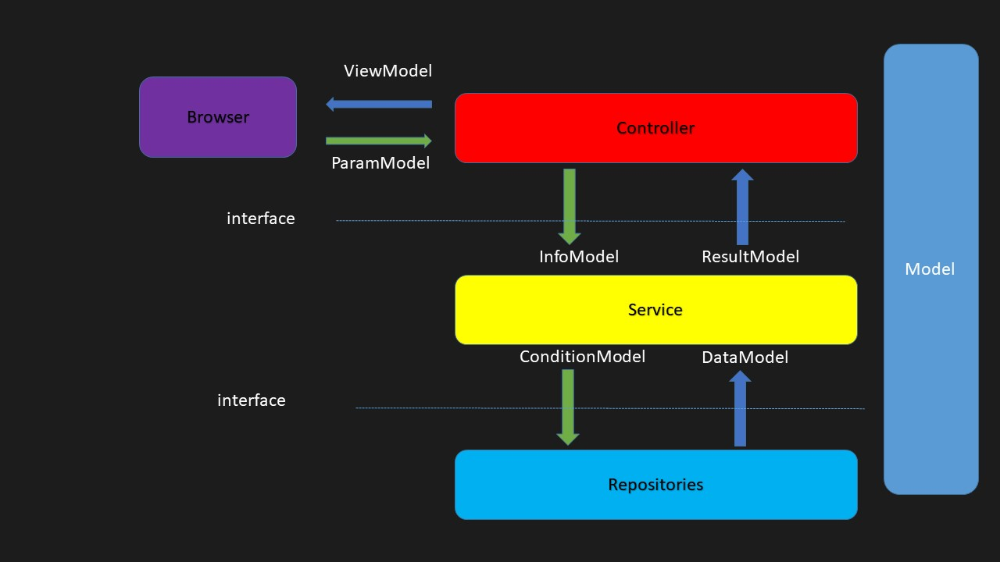

### Repository Pattern 範例碼

Repository Pattern - 使用 Dapper

Repository Pattern - 使用 Entity Framework Core

架構

需安裝的 NuGet Packages

AutoMapper

AutoMapper.Extensions.Microsoft.DependencyInj

Dapper

Microsoft.EntityFrameworkCore

Microsoft.EntityFrameworkCore.SqlServer

Microsoft.Extensions.DependencyInjection

MySql.Data

Newtonsoft.Json

Swashbuckle.AspNetCore

Swashbuckle.AspNetCore.Swagger

System.Data.SqlClient